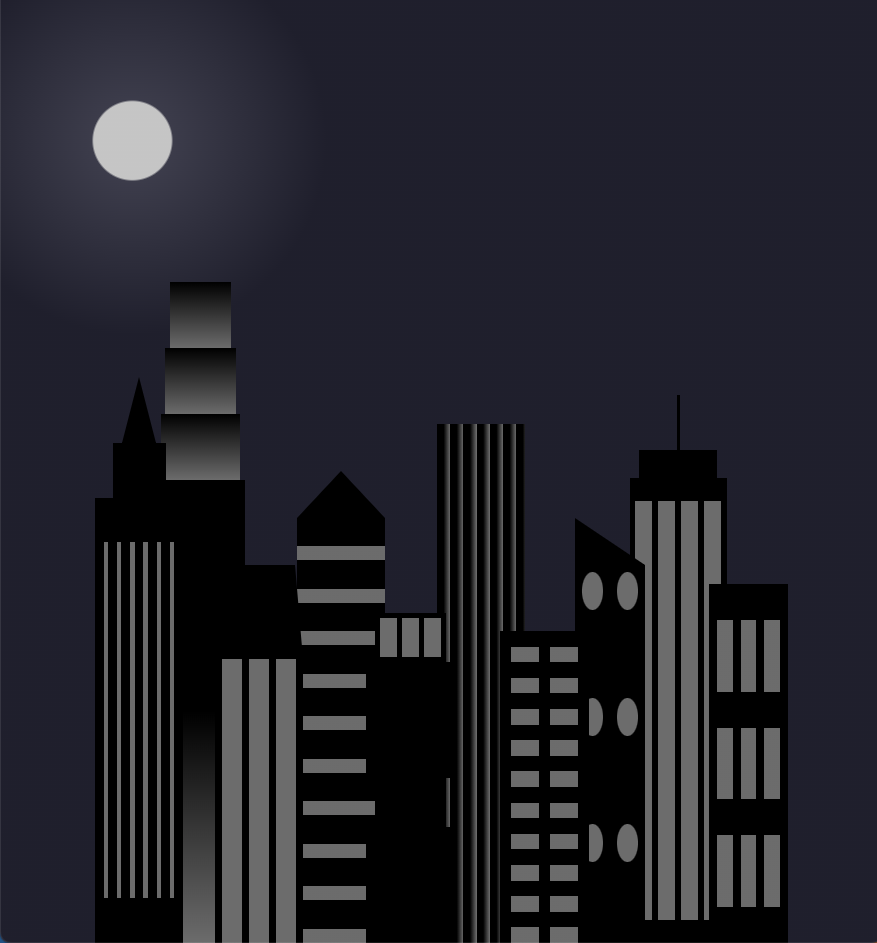

# City Skyline

Project demonstrating CSS variables

## Preview

This project is deployed via Github [pages](https://katepatch.github.io/City-Skyline/)

## Screenshots

When screen size is over 1000px the skyline is shown as a city during the day 

When is screen size is less than 1000px the skyline is shown as a city at night

## Questions

For questions regarding this project or any others I can be reached at: 
Github: [katepatch](https://github.com/katepatch) 
Email: kate.epatch@gmail.com
